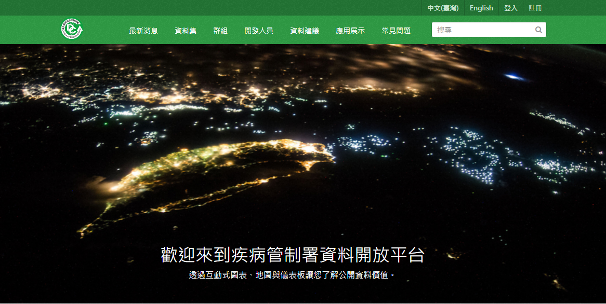
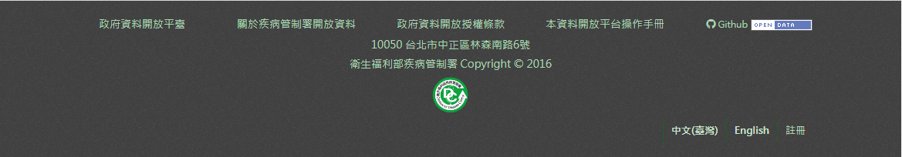

.. You should enable this project on travis-ci.org and coveralls.io to make
   these badges work. The necessary Travis and Coverage config files have been
   generated for you.

.. image:: https://travis-ci.org/jiankaiwang/ckanext-cdcframe.svg?branch=master
    :target: https://travis-ci.org/jiankaiwang/ckanext-cdcframe

=============
ckanext-cdcframe
=============

The ckan extension conserves the webpage frame for Taiwan CDC open data portal.

* the whole site css, javascript
* the SyntaxHighlighter project resource
* the navigation bar and homepage image

* the footer section

------------
Requirements
------------

* Developed on CKAN 2.5.x

------------
Installation
------------

To install ckanext-cdcframe:

1. Activate your CKAN virtual environment, for example::

     . /usr/lib/ckan/default/bin/activate

2. Clone the ckanext-cdcframe from github, for example::

     cd /usr/lib/ckan/default/src/

     https://github.com/jiankaiwang/ckanext-cdcframe.git

3. Install the ckanext-cdcframe Python package into your virtual environment::

     cd /usr/lib/ckan/default/src/ckanext-cdcframe

     pip install .

4. Add ``cdcframe`` to the ``ckan.plugins`` setting in your CKAN
   config file (by default the config file is located at
   ``/etc/ckan/default/production.ini``).

5. Restart CKAN. For example if you've deployed CKAN with Apache on Ubuntu::

     sudo service apache2 reload

   If you've deployed CKAN with uwsgi::

     uwsgi --ini-paste /etc/ckan/default/production.ini

   If you've create a ckan.service::

     sudo systemctl restart ckan.service

---------------
Config Settings
---------------

1. Make sure adding `cdcframe` to the `ckan.plugins`. For example::
   
   ckan.plugins = cdcframe

2. Add `extra_public_paths` to allow viewing `public` folder::

   extra_public_paths = /usr/lib/ckan/default/src/ckanext-cdcframe/ckanext/cdcframe/public

------------------------
Development Installation
------------------------

To install ckanext-cdcframe for development, activate your CKAN virtualenv and
do::

    git clone https://github.com/jiankaiwang/ckanext-cdcframe.git
    cd ckanext-cdcframe
    python setup.py develop
    pip install -r dev-requirements.txt

----------------------------------------
Releasing a New Version of ckanext-cdcframe
----------------------------------------

1. Update the version number in the ``setup.py`` file.
   See `PEP 440 <http://legacy.python.org/dev/peps/pep-0440/#public-version-identifiers>`_
   for how to choose version numbers.

2. Create a source distribution of the new version::

     python setup.py sdist

3. Upload the source distribution to PyPI::

     python setup.py sdist upload

4. Tag the new release of the project on GitHub with the version number from
   the ``setup.py`` file. For example if the version number in ``setup.py`` is
   0.0.2 then do::

       git tag 0.0.2
       git push --tags
